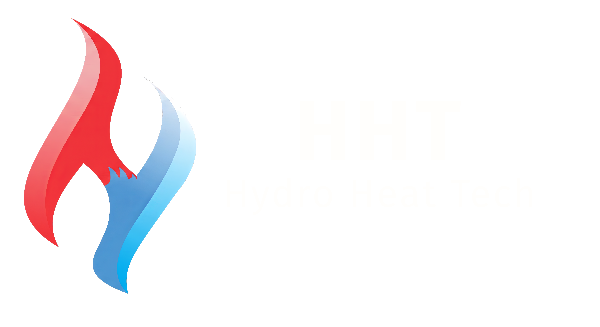

# Hydro Heat Tech (HHT) - Mühəndislik Həlləri Platforması



**Hydro Heat Tech (HHT)** — Azərbaycanın sənaye və kommersiya sektorunda nasos, istilik və su təchizatı sistemləri üzrə ixtisaslaşmış mühəndislik şirkətinin rəsmi veb platformasıdır. Bu proyekt müasir mühəndislik standartlarına uyğun, sürətli və tam responsive (mobil uyğunlu) olaraq hazırlanmışdır.

## 🚀 Texnologiya Steki

Bu layihə aşağıdakı texnologiyalar istifadə edilərək yaradılmışdır:

*   **React.js (v18+)** - İstifadəçi interfeysi üçün.
*   **Tailwind CSS** - Müasir və sürətli stilizasiya (Utility-first CSS).
*   **React Router DOM** - Səhifədaxili naviqasiya üçün.
*   **Lucide React** - Minimalist və peşəkar ikonlar sistemi.
*   **Vite** - Sürətli inkişaf və build prosesi üçün.

## ✨ Əsas Özəlliklər

1.  **Hamar Naviqasiya (Smooth Scroll):** Header və Footer linklərinə kliklədikdə səhifənin müvafiq bölmələrinə hamar keçid.
2.  **Tam Responsive Dizayn:** Mobil (iPhone, Android), planşet (iPad) və geniş ekranlı monitorlar üçün tam optimallaşdırılmış interfeys.
3.  **Dinamik Xidmət Kartları:** 14 fərqli mühəndislik xidmətinin vizual şəkillər və təsvirlərlə təqdimatı.
4.  **Brend Matrisi:** Qlobal brendlərin (Ebara, Grundfos, Wilo və s.) rəsmi nümayəndəlik məlumatlarının interaktiv nümayişi.
5.  **Texniki Proses Axını:** Su təmizləmə prosesinin 6 mərhələli ziq-zaq sxemi ilə vizual izahı.
6.  **Müştəri Portfeli:** 148-dən çox dövlət və özəl sektor referanslarının kateqoriyalar üzrə qruplaşdırılması.
7.  **SEO & Accessibility:** Lighthouse standartlarına uyğun yüksək rəng kontrastı və toxunuş hədəfləri (touch targets).

## 📂 Layihə Strukturu

```text
src/
 ├── assets/          
 ├── components/      
 │    ├── Header.jsx
 │    ├── Footer.jsx
 │    ├── Hero.jsx
 │    ├── About.jsx
 │    ├── Services.jsx
 │    ├── Brands.jsx
 │    ├── Chunk.jsx
 │    ├── ProcessStep.jsx
 │    └── Clients.jsx
 ├── App.jsx          
 └── main.jsx        

